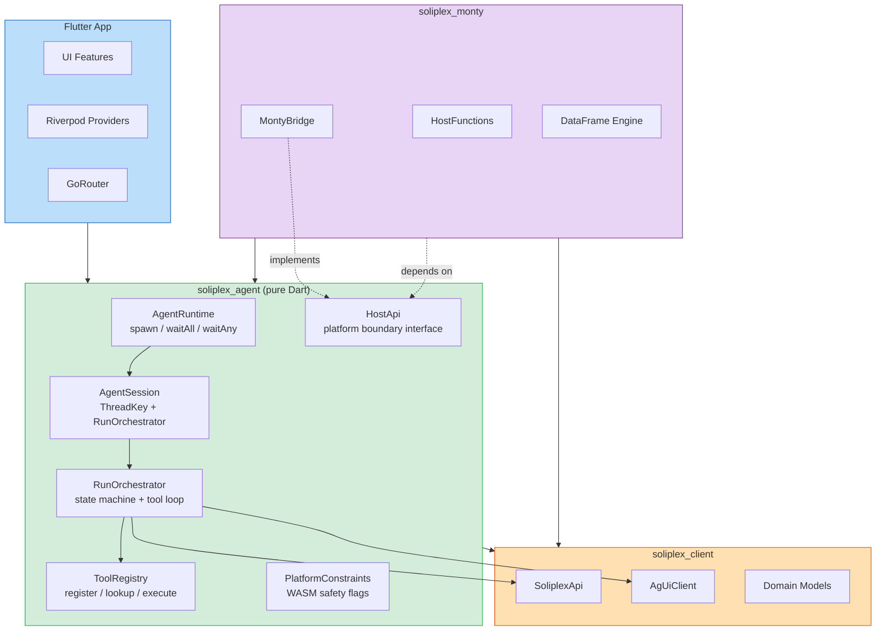
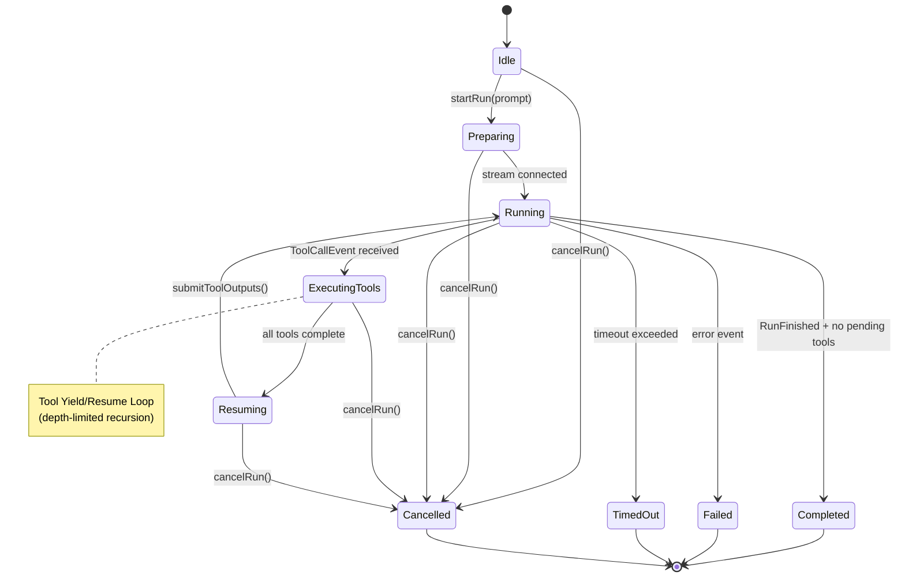
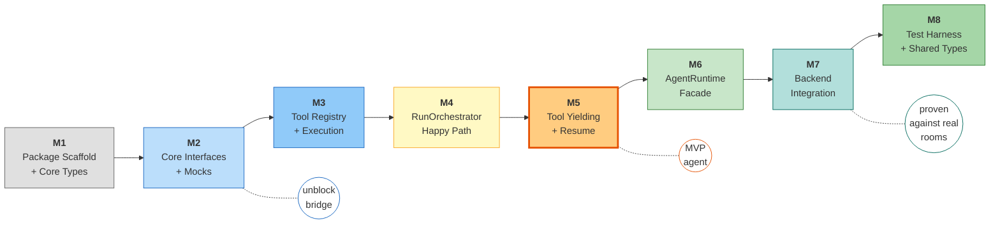
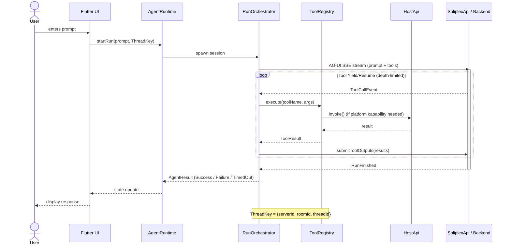
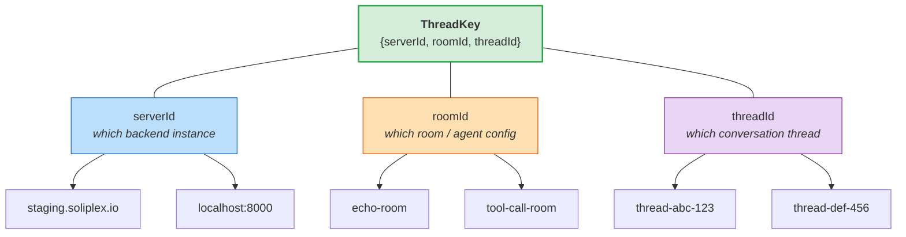

# Architecture Diagrams

## Package Architecture

```mermaid
graph TD
    subgraph FlutterApp["Flutter App"]
        UI["UI Features"]
        Providers["Riverpod Providers"]
        Router["GoRouter"]
    end

    subgraph Agent["soliplex_agent (pure Dart)"]
        Runtime["AgentRuntime<br/>spawn / waitAll / waitAny"]
        Session["AgentSession<br/>ThreadKey + RunOrchestrator"]
        Orchestrator["RunOrchestrator<br/>state machine + tool loop"]
        Registry["ToolRegistry<br/>register / lookup / execute"]
        HostApi["HostApi<br/>platform boundary interface"]
        Constraints["PlatformConstraints<br/>WASM safety flags"]
    end

    subgraph Monty["soliplex_monty"]
        Bridge["MontyBridge"]
        HostFns["HostFunctions"]
        DataFrame["DataFrame Engine"]
    end

    subgraph Client["soliplex_client"]
        Api["SoliplexApi"]
        AgUi["AgUiClient"]
        Domain["Domain Models"]
    end

    FlutterApp --> Agent
    Agent --> Client
    Monty --> Agent
    Monty --> Client
    Runtime --> Session
    Session --> Orchestrator
    Orchestrator --> Registry
    Orchestrator --> Api
    Orchestrator --> AgUi
    Bridge -.->|implements| HostApi
    Monty -.->|depends on| HostApi

    style Agent fill:#d4edda,stroke:#28a745
    style Monty fill:#e8d5f5,stroke:#7b2d8e
    style Client fill:#ffe0b2,stroke:#e65100
    style FlutterApp fill:#bbdefb,stroke:#1565c0
```

## RunOrchestrator State Machine

```mermaid
stateDiagram-v2
    [*] --> Idle

    Idle --> Preparing : startRun(prompt)
    Preparing --> Running : stream connected

    Running --> ExecutingTools : ToolCallEvent received
    ExecutingTools --> Resuming : all tools complete
    Resuming --> Running : submitToolOutputs()

    Running --> Completed : RunFinished + no pending tools
    Running --> Failed : error event
    Running --> TimedOut : timeout exceeded

    Idle --> Cancelled : cancelRun()
    Preparing --> Cancelled : cancelRun()
    Running --> Cancelled : cancelRun()
    ExecutingTools --> Cancelled : cancelRun()
    Resuming --> Cancelled : cancelRun()

    Completed --> [*]
    Failed --> [*]
    TimedOut --> [*]
    Cancelled --> [*]

    note right of ExecutingTools
        Tool Yield/Resume Loop
        (depth-limited recursion)
    end note

    state "Running" as Running
    state "ExecutingTools" as ExecutingTools
    state "Resuming" as Resuming
```

## Milestone Roadmap

```mermaid
graph LR
    M1["<b>M1</b><br/>Package Scaffold<br/>+ Core Types"]
    M2["<b>M2</b><br/>Core Interfaces<br/>+ Mocks"]
    M3["<b>M3</b><br/>Tool Registry<br/>+ Execution"]
    M4["<b>M4</b><br/>RunOrchestrator<br/>Happy Path"]
    M5["<b>M5</b><br/>Tool Yielding<br/>+ Resume"]
    M6["<b>M6</b><br/>AgentRuntime<br/>Facade"]
    M7["<b>M7</b><br/>Backend<br/>Integration"]
    M8["<b>M8</b><br/>Test Harness<br/>+ Shared Types"]

    M1 --> M2 --> M3 --> M4 --> M5 --> M6 --> M7 --> M8

    M2 -.- Stop1(("unblock<br/>bridge"))
    M5 -.- Stop2(("MVP<br/>agent"))
    M7 -.- Stop3(("proven<br/>against real<br/>rooms"))

    style M1 fill:#e0e0e0,stroke:#616161
    style M2 fill:#bbdefb,stroke:#1565c0
    style M3 fill:#90caf9,stroke:#1565c0
    style M4 fill:#fff9c4,stroke:#f9a825
    style M5 fill:#ffcc80,stroke:#e65100,stroke-width:3px
    style M6 fill:#c8e6c9,stroke:#2e7d32
    style M7 fill:#b2dfdb,stroke:#00695c
    style M8 fill:#a5d6a7,stroke:#2e7d32
    style Stop1 fill:#fff,stroke:#1565c0
    style Stop2 fill:#fff,stroke:#e65100
    style Stop3 fill:#fff,stroke:#00695c
```

## Data Flow — Prompt to Response

```mermaid
sequenceDiagram
    actor User
    participant UI as Flutter UI
    participant RT as AgentRuntime
    participant RO as RunOrchestrator
    participant TR as ToolRegistry
    participant HA as HostApi
    participant BE as SoliplexApi / Backend

    User->>UI: enters prompt
    UI->>RT: startRun(prompt, ThreadKey)
    RT->>RO: spawn session

    RO->>BE: AG-UI SSE stream (prompt + tools)
    activate BE

    loop Tool Yield/Resume (depth-limited)
        BE-->>RO: ToolCallEvent
        RO->>TR: execute(toolName, args)
        TR->>HA: invoke() (if platform capability needed)
        HA-->>TR: result
        TR-->>RO: ToolResult
        RO->>BE: submitToolOutputs(results)
    end

    BE-->>RO: RunFinished
    deactivate BE

    RO-->>RT: AgentResult (Success / Failure / TimedOut)
    RT-->>UI: state update
    UI-->>User: display response

    Note over RO,TR: ThreadKey = {serverId, roomId, threadId}
```

## ThreadKey Identity Model

```mermaid
graph TD
    TK["<b>ThreadKey</b><br/>{serverId, roomId, threadId}"]

    S["serverId<br/><i>which backend instance</i>"]
    R["roomId<br/><i>which room / agent config</i>"]
    T["threadId<br/><i>which conversation thread</i>"]

    TK --- S
    TK --- R
    TK --- T

    S --> S1["staging.soliplex.io"]
    S --> S2["localhost:8000"]
    R --> R1["echo-room"]
    R --> R2["tool-call-room"]
    T --> T1["thread-abc-123"]
    T --> T2["thread-def-456"]

    style TK fill:#d4edda,stroke:#28a745,stroke-width:2px
    style S fill:#bbdefb,stroke:#1565c0
    style R fill:#ffe0b2,stroke:#e65100
    style T fill:#e8d5f5,stroke:#7b2d8e
```
