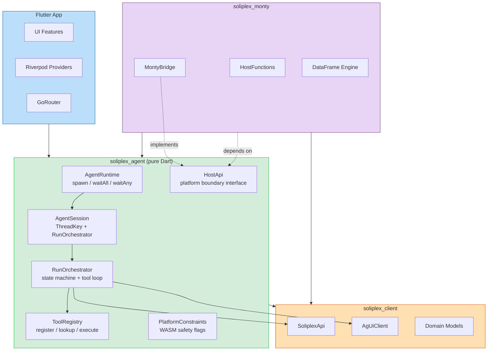
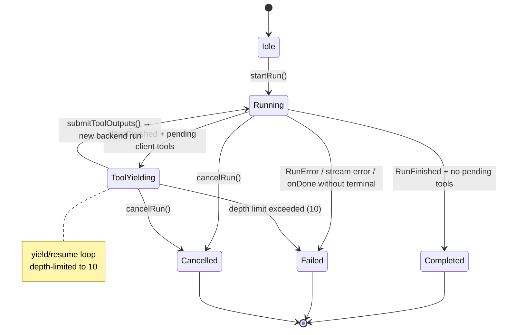
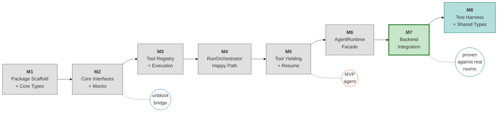
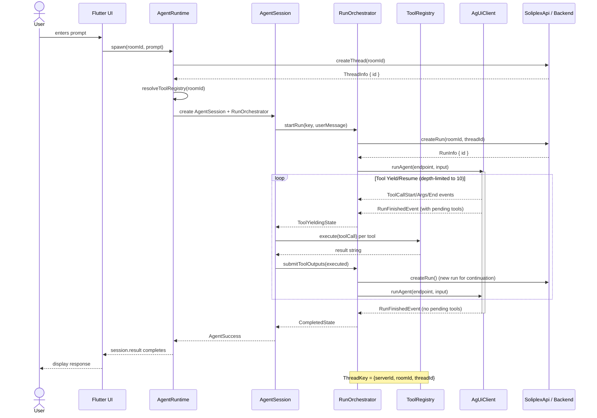
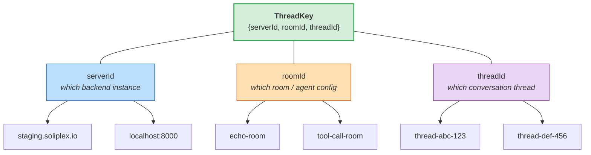

# Architecture Diagrams

## Package Architecture

## RunOrchestrator State Machine

Reflects the actual 6-state sealed hierarchy in `run_state.dart`.

## Milestone Roadmap

## Data Flow — Prompt to Response

## ThreadKey Identity Model

