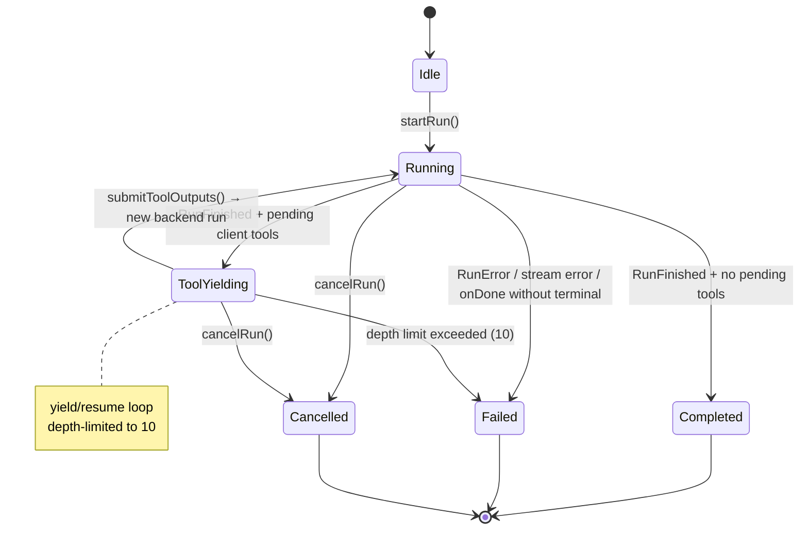
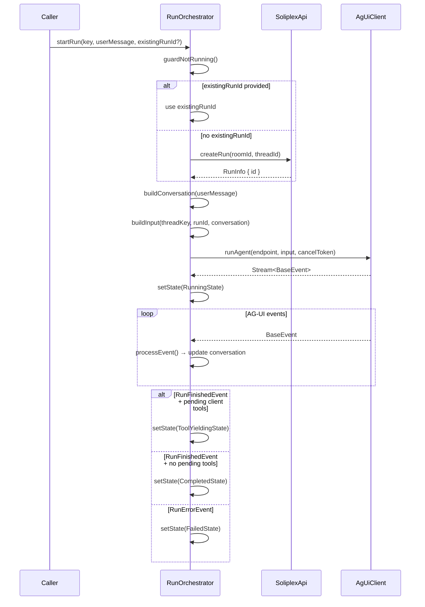
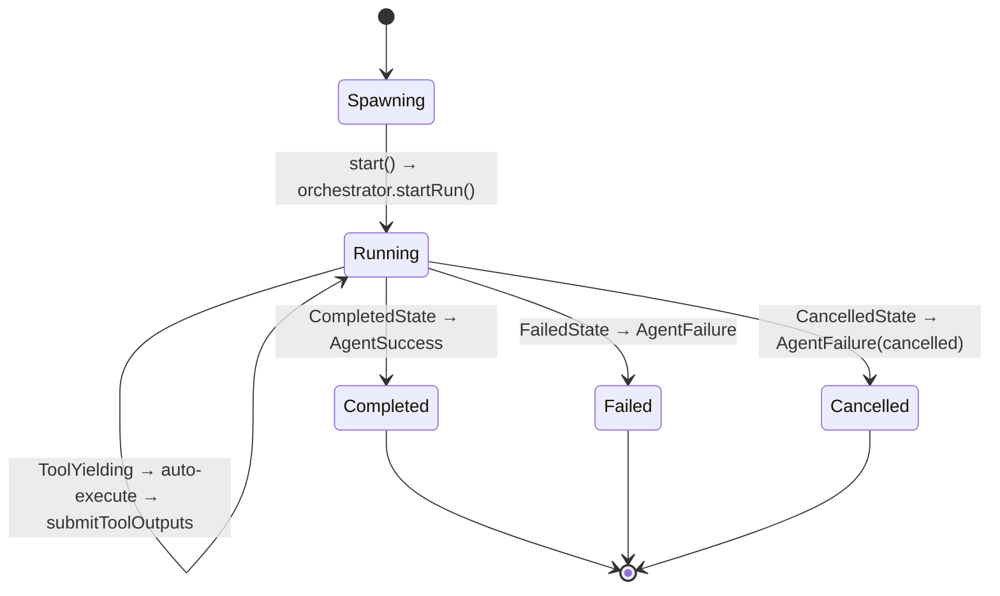

# Orchestration Guide

How `RunOrchestrator` drives a single AG-UI run through its state machine,
and how `AgentSession` wraps it with automatic tool execution.

## RunOrchestrator State Machine

Six sealed subtypes of `RunState`. The orchestrator holds exactly one at
any time.



### State descriptions

| State | Class | Meaning |
|-------|-------|---------|
| Idle | `IdleState` | No active run. Ready for `startRun()`. |
| Running | `RunningState` | SSE stream connected, processing events. Holds `threadKey`, `runId`, `conversation`, `streaming`. |
| ToolYielding | `ToolYieldingState` | `RunFinishedEvent` arrived with pending client-side tool calls. Holds `pendingToolCalls` and `toolDepth`. |
| Completed | `CompletedState` | `RunFinishedEvent` arrived with no pending client tools. Terminal. |
| Failed | `FailedState` | Error occurred. Holds `FailureReason` and error string. Terminal. |
| Cancelled | `CancelledState` | `cancelRun()` called during Running or ToolYielding. Terminal. |

### FailureReason classification

Errors are classified by `classifyError()` in `error_classifier.dart`:

| Reason | Trigger |
|--------|---------|
| `serverError` | `RunErrorEvent` in the AG-UI stream |
| `authExpired` | `AuthException` (401/403) |
| `networkLost` | Stream ends without terminal event, or `NetworkException` |
| `rateLimited` | `RateLimitException` (429) |
| `toolExecutionFailed` | Tool depth limit exceeded |
| `internalError` | Unclassified exception |
| `cancelled` | `cancelRun()` called by caller |

## startRun() flow



## Tool yielding semantics

When `RunFinishedEvent` arrives, the orchestrator checks for pending
client-side tool calls — tools whose names are registered in the
`ToolRegistry`. Server-side tools (not in the registry) pass through
without triggering a yield.

**submitToolOutputs() creates a new backend run.** The backend rejects
re-posting to an existing run ID. The full conversation (including a
`ToolCallMessage` with results) is sent so the model sees the tool
output.

**Depth limit:** 10 yield/resume cycles. Exceeding this transitions to
`FailedState(toolExecutionFailed)`.

## Wiring example

```dart
final orchestrator = RunOrchestrator(
  api: soliplexApi,
  agUiClient: agUiClient,
  toolRegistry: registry,
  platformConstraints: NativePlatformConstraints(),
  logger: logger,
);

orchestrator.stateChanges.listen((state) {
  switch (state) {
    case RunningState(:final conversation):
      // Update UI with streaming conversation
    case ToolYieldingState(:final pendingToolCalls):
      // Execute tools, then:
      orchestrator.submitToolOutputs(executedTools);
    case CompletedState(:final conversation):
      // Display final response
    case FailedState(:final reason, :final error):
      // Handle error by reason
    case CancelledState():
      // Show cancelled state
    case IdleState():
      break;
  }
});

await orchestrator.startRun(
  key: threadKey,
  userMessage: 'Do I need an umbrella?',
);
```

## AgentSession auto-execute loop

`AgentSession` wraps a `RunOrchestrator` and automatically handles
`ToolYieldingState` — the caller never sees it. The session subscribes
to `stateChanges` and runs this loop:



### Auto-execute detail

When `ToolYieldingState` arrives:

1. For each tool call in `pendingToolCalls`:
   - Look up executor in `ToolRegistry`
   - Call `toolRegistry.execute(toolCall)`
   - On success: `ToolCallStatus.completed` + result string
   - On error: `ToolCallStatus.failed` + error string (logged, not fatal)
2. Call `orchestrator.submitToolOutputs(executedTools)`
3. Orchestrator creates new backend run, reconnects stream
4. Repeat until `CompletedState` or `FailedState`

The entire execute/resume path is wrapped in try/catch to prevent
unhandled future errors from the `unawaited()` call in `_onStateChange`.

### Result mapping

| RunState | AgentResult | AgentSessionState |
|----------|-------------|-------------------|
| `CompletedState` | `AgentSuccess(output: lastAssistantText)` | `completed` |
| `FailedState` | `AgentFailure(reason, error)` | `failed` |
| `CancelledState` | `AgentFailure(reason: cancelled)` | `cancelled` |
