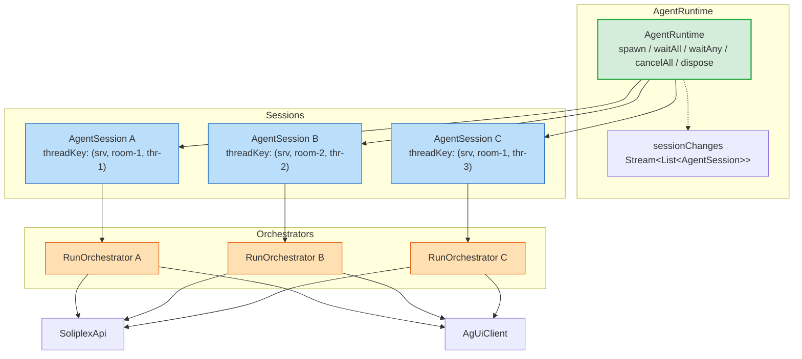
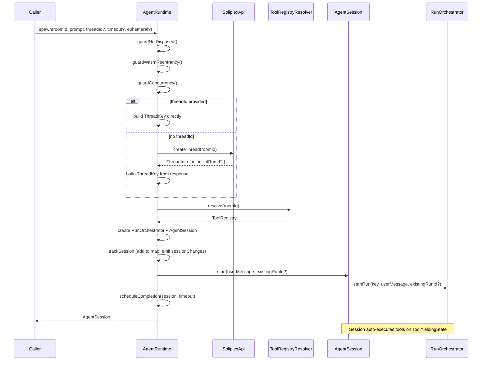
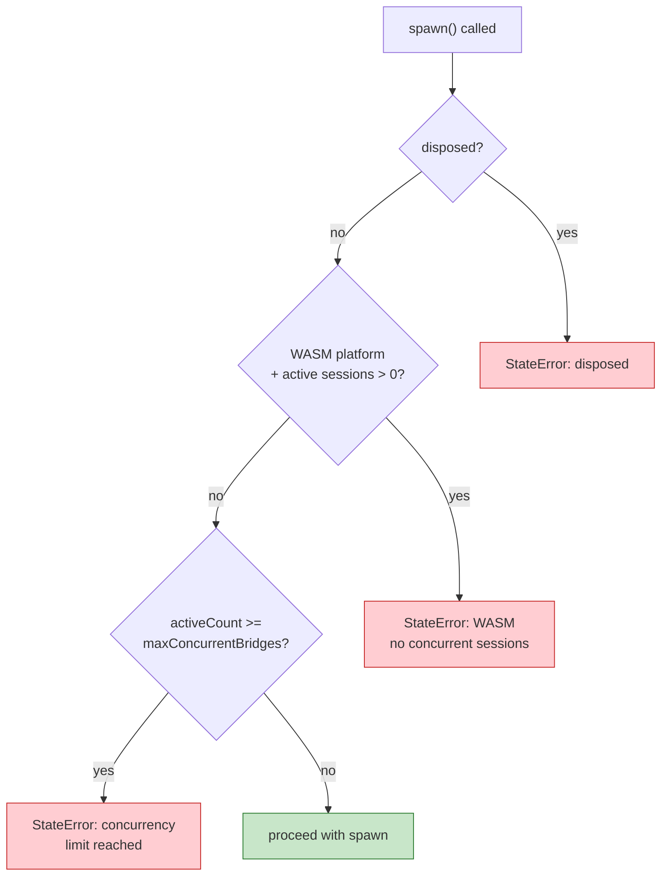
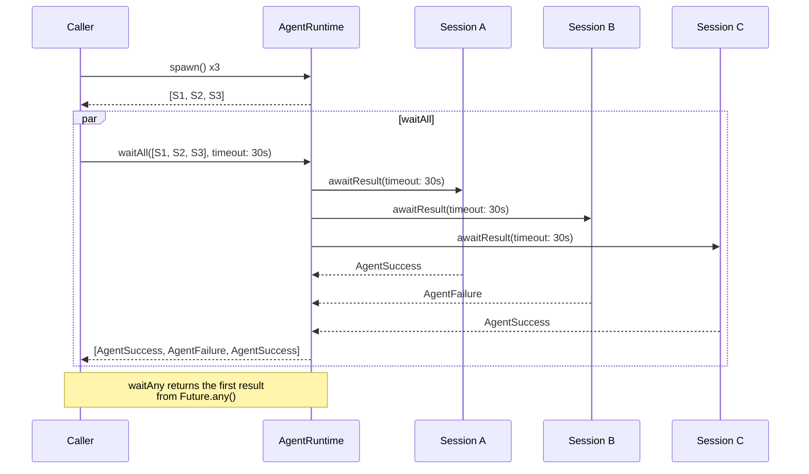
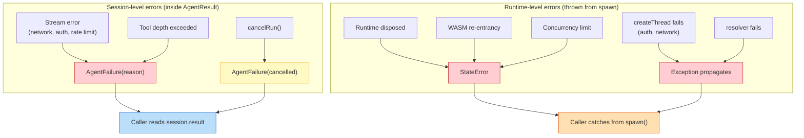
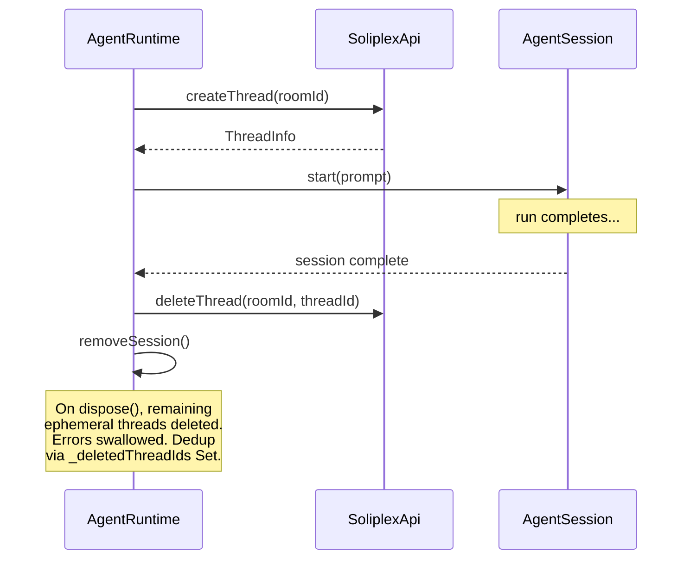
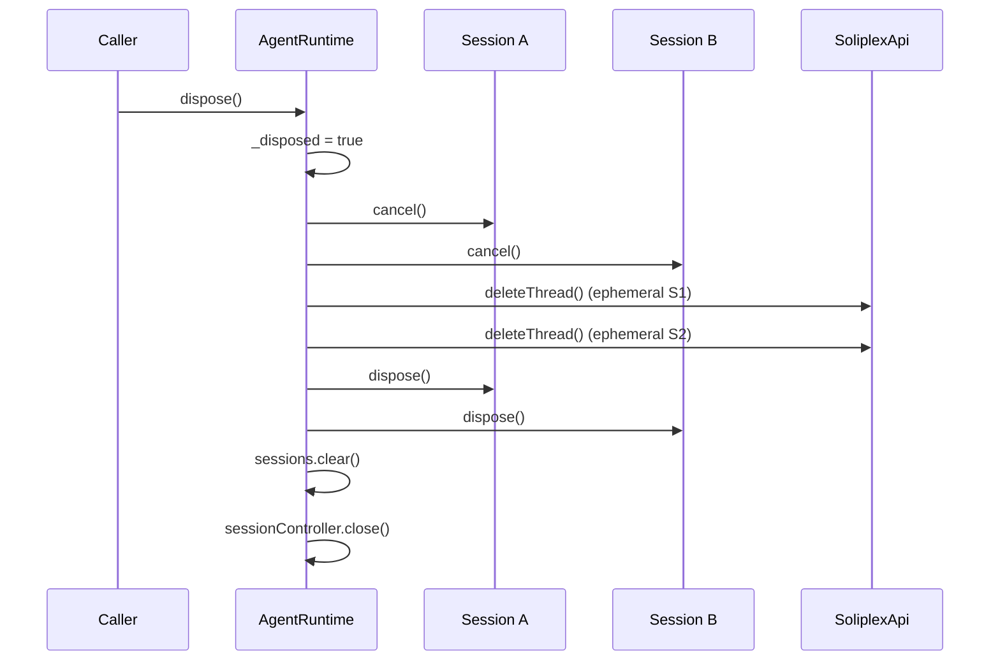

# Runtime Guide

How `AgentRuntime` coordinates multiple `AgentSession` instances,
enforces platform constraints, and manages thread lifecycle.

## Architecture



Each `AgentRuntime` is bound to a single backend via `SoliplexApi`.
The `serverId` (defaults to `'default'`) is embedded into every
`ThreadKey` created by `spawn()`. Multiple servers = multiple runtime
instances.

Each `spawn()` call creates a fresh `RunOrchestrator` and
`AgentSession`. The session auto-executes tools and completes with
an `AgentResult`.

## spawn() flow



## Concurrency model



### Platform constraints

| Platform | `supportsReentrantInterpreter` | `maxConcurrentBridges` | Effect |
|----------|-------------------------------|------------------------|--------|
| Native | `true` | `4` (default) | Many concurrent sessions |
| Web (WASM) | `false` | `1` | Single session; WASM guard blocks 2nd spawn |

The WASM guard prevents deadlocks where a sub-agent tool call would
require Python execution while Python is already suspended on
`wait_all()`. Validated in spike testing.

## waitAll / waitAny



`waitAll` uses `Future.wait` — all sessions must complete. One failure
does not cancel the others. The caller receives all results and can
inspect each.

`waitAny` uses `Future.any` — returns the first session to complete.
Other sessions continue running (cancel manually if needed).

## Error propagation



Two error paths:

1. **Session-level**: Errors during the run (stream errors, tool depth,
   cancel) flow through `AgentResult`. Read via `session.result`.
2. **Runtime-level**: Errors before the run starts (guards, thread
   creation, tool resolution) throw synchronously from `spawn()`.
   The caller catches them directly.

## Ephemeral thread lifecycle



Sessions default to `ephemeral: true`. The thread is deleted on the
backend when the session completes or when the runtime is disposed.
Non-ephemeral sessions (`ephemeral: false`) skip thread deletion —
useful for persistent conversations.

## dispose() sequence



After `dispose()`, any call to `spawn()` throws `StateError`.

## Usage examples

### Single agent

```dart
final runtime = AgentRuntime(
  api: api,
  agUiClient: agUiClient,
  toolRegistryResolver: (roomId) async => registry,
  platform: NativePlatformConstraints(),
  logger: logger,
);

final session = await runtime.spawn(
  roomId: 'weather',
  prompt: 'Do I need an umbrella?',
);

final result = await session.result;
switch (result) {
  case AgentSuccess(:final output):
    print(output); // "Yes, bring an umbrella."
  case AgentFailure(:final reason):
    print('Failed: $reason');
  case AgentTimedOut(:final elapsed):
    print('Timed out after $elapsed');
}

await runtime.dispose();
```

### Parallel agents with waitAll

```dart
final s1 = await runtime.spawn(roomId: 'weather', prompt: 'NYC weather?');
final s2 = await runtime.spawn(roomId: 'weather', prompt: 'London weather?');
final s3 = await runtime.spawn(roomId: 'weather', prompt: 'Tokyo weather?');

final results = await runtime.waitAll(
  [s1, s2, s3],
  timeout: Duration(seconds: 30),
);

for (final result in results) {
  switch (result) {
    case AgentSuccess(:final output):
      print(output);
    case AgentFailure(:final reason):
      print('One failed: $reason');
    case AgentTimedOut():
      print('One timed out');
  }
}
```

### Race with waitAny

```dart
final s1 = await runtime.spawn(roomId: 'fast-model', prompt: query);
final s2 = await runtime.spawn(roomId: 'slow-model', prompt: query);

final first = await runtime.waitAny([s1, s2]);
await runtime.cancelAll(); // cancel the loser
```
