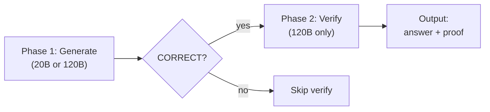
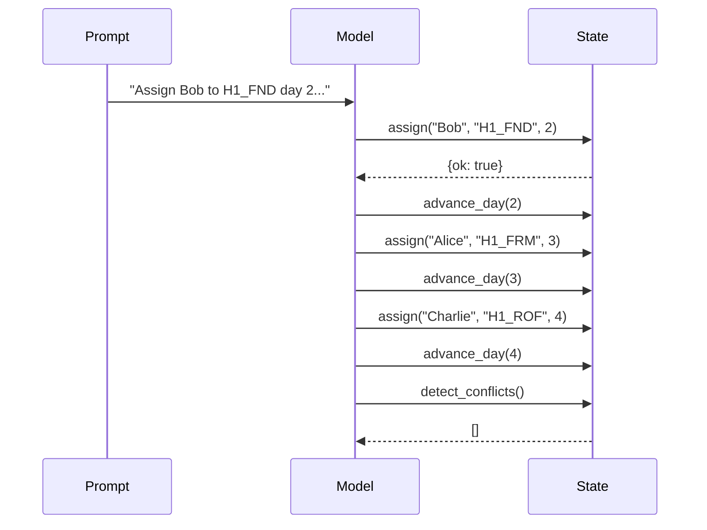
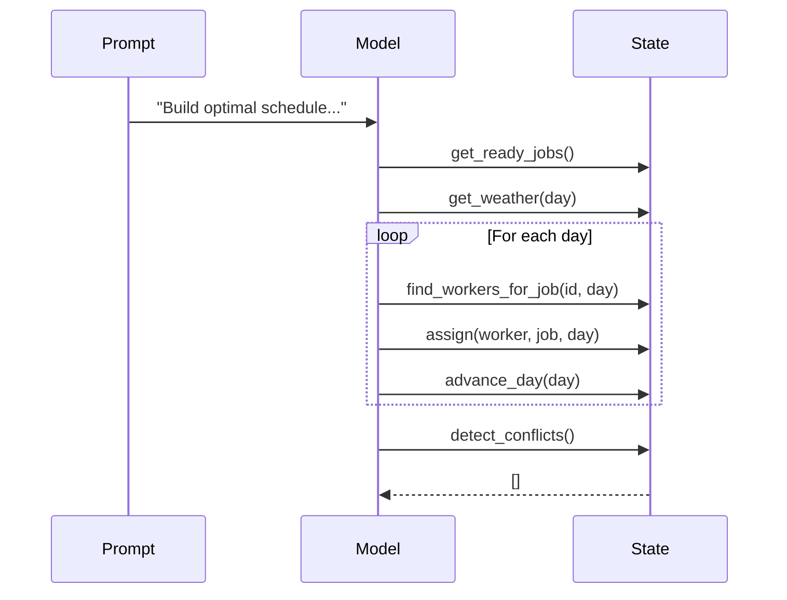
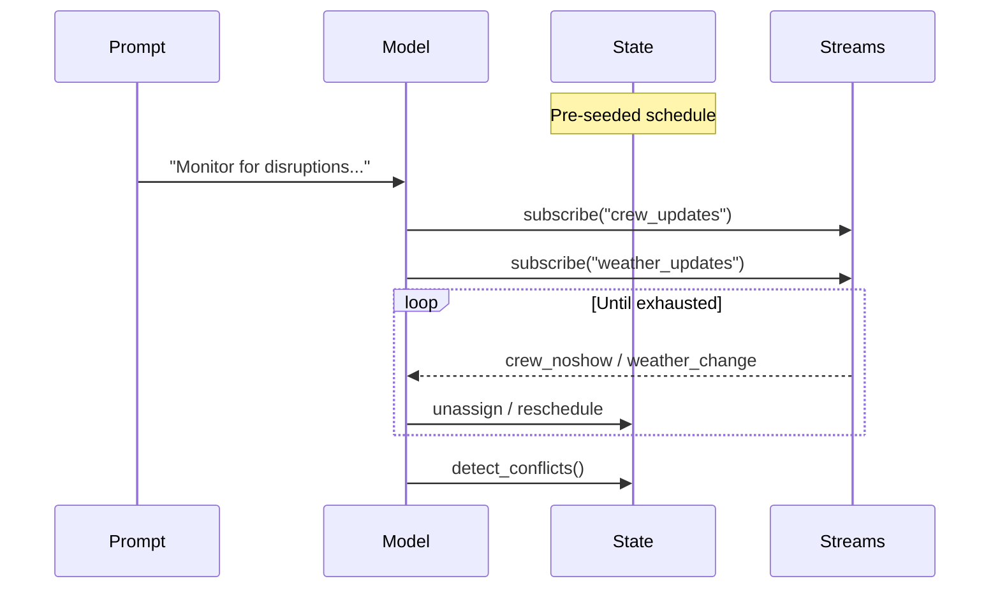
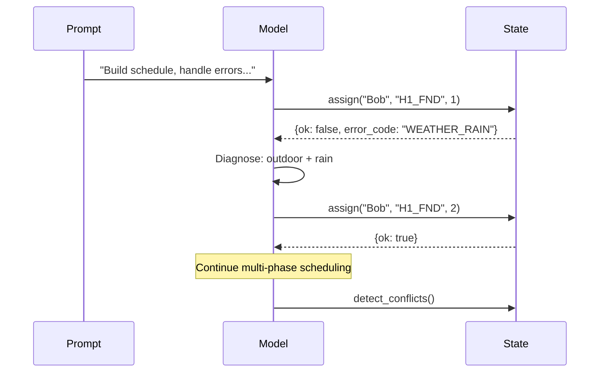
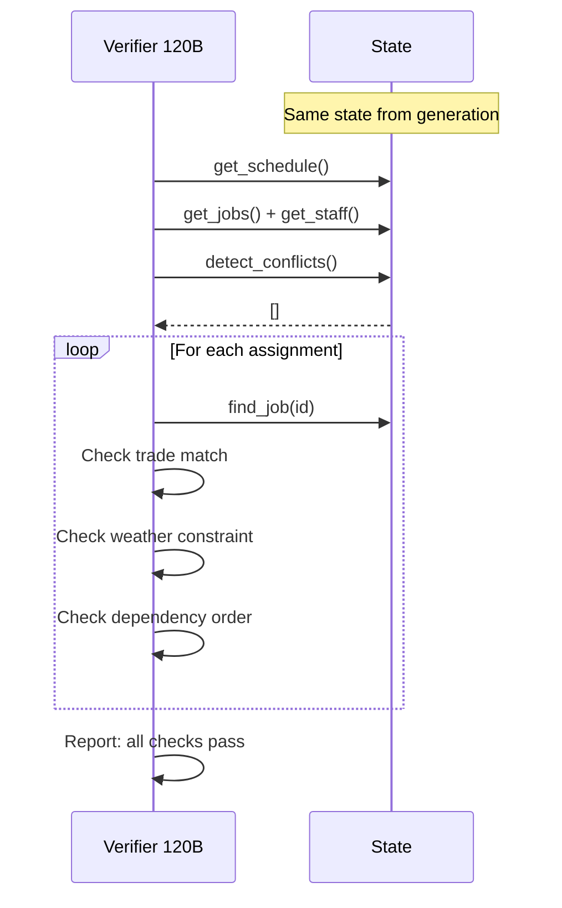

# Construction Scheduling Experiment

Validated eval with reverse verification.

**Date:** 2026-03-06
**Server:** localhost:8000 (Ollama)
**Models:** gpt-oss:20b, gpt-oss:120b
**Iterations:** 5
**Reference:** See `construction-scheduling-2026-03-06.md` for
prompts, host functions, test data, and architecture.

## Experiment Design

### Two-Phase Eval: Generate then Verify

Every tier runs in two phases. Phase 1 generates the answer.
Phase 2 immediately verifies it -- like checking your work in
math by working backwards. The generation and verification are
**paired together**: the verify step uses the exact same
`ConstructionState` that generation produced, with no gap
between them.

The verify phase asks 120B to work backwards through the
schedule: inspect every assignment, check trade qualifications,
confirm dependency ordering, verify weather constraints, detect
conflicts. If the verifier agrees the schedule is correct AND
has not mutated the state, the answer has been **proven correct
from both directions**.

### Why pair them?

The generation answer and the reverse-verification step happen
in the same iteration, on the same state object, with no
serialization boundary. This means:

- No data lost or corrupted between phases
- The verifier sees the exact state the generator produced
- Any mutation by the verifier is immediately detectable
  (schedule snapshot comparison)

## Tier Architecture

### T1: Prescriptive (follow explicit instructions)

Model translates natural language instructions into correct
function calls.

### T2: Scheduler (constraint satisfaction)

Model reasons about weather, dependencies, and trades to build
an optimal schedule from scratch.

### T3: Dispatcher (reactive stream processing)

Model reacts to real-time stream events on a pre-seeded
schedule.

### T4: Recovery (error handling + retry)

Model handles assignment failures, diagnoses error codes, and
retries with corrected parameters.

### T5: Verify (reverse proof)

120B works backwards through the generated schedule, verifying
each constraint holds. Instead of building a schedule that
satisfies constraints, the model starts with the schedule and
proves the constraints are satisfied.

## Scoring Criteria

| Tier | Checks |
| ------ | -------- |
| T1 | 3 assigns, 0 conflicts, exact assignments, completed |
| T2 | 5 assigns, 0 conflicts, completed, no outdoor d1, span<=4 |
| T3 | 0 conflicts, Alice off d3, no outdoor d4, Bob preserved |
| T4 | 5 assigns, 0 conflicts, completed, no outdoor d1 |
| T5 | Original tier checks + >=1 call + state preserved |

## Results (v3)

### T1 Prescriptive Results

| Run | 20B | 120B |
| --- | --- | --- |
| 1 | CORRECT 6/6 (14s, 1) | INCORRECT 3/6 srv400 |
| 2 | CORRECT 6/6 (6s, 4) | INCORRECT 3/6 srv400 |
| 3 | CORRECT 6/6 (7s, 4) | INCORRECT 5/6 depth |
| 4 | CORRECT 6/6 (7s, 4) | CORRECT 6/6 (11s, 2) |
| 5 | CORRECT 6/6 (6s, 4) | INCORRECT 3/6 srv400 |
| **Sum** | **5/5** | **1/5** |

### T2 Scheduler Results

| Run | 20B | 120B |
| --- | --- | --- |
| 1 | CORRECT 5/5 (5s, 1) | CORRECT 5/5 (14s, 2) |
| 2 | CORRECT 5/5 (11s, 1) | CORRECT 5/5 (15s, 2) |
| 3 | CORRECT 5/5 (14s, 1) | CORRECT 5/5 (11s, 1) |
| 4 | CORRECT 5/5 (20s, 1) | CORRECT 5/5 (22s, 3) |
| 5 | INCORRECT 3/5 (4s, 0) | CORRECT 5/5 (31s, 5) |
| **Sum** | **4/5** | **5/5** |

### T3 Dispatcher Results

| Run | 20B | 120B |
| --- | --- | --- |
| 1 | CORRECT 5/5 (23s, 2) | CORRECT 5/5 (10s, 1) |
| 2 | CORRECT 5/5 (12s, 1) | CORRECT 5/5 (11s, 1) |
| 3 | CORRECT 5/5 (6s, 1) | CORRECT 5/5 (13s, 1) |
| 4 | CORRECT 5/5 (9s, 1) | CORRECT 5/5 (9s, 1) |
| 5 | CORRECT 5/5 (10s, 1) | CORRECT 5/5 (12s, 1) |
| **Sum** | **5/5** | **5/5** |

### T4 Recovery Results

| Run | 20B | 120B |
| --- | --- | --- |
| 1 | INCORRECT 2/4 (16s, 1) | CORRECT 4/4 (36s, 3) |
| 2 | INCORRECT 2/4 (5s, 1) | CORRECT 4/4 (10+) |
| 3 | CORRECT 4/4 (30s, 4) | CORRECT 4/4 (31s, 2) |
| 4 | INCORRECT 2/4 (9s, 1) | CORRECT 4/4 (43s, 5) |
| 5 | INCORRECT 2/4 (9s, 1) | CORRECT 4/4 (61s, 7) |
| **Sum** | **1/5** | **5/5** |

### T5 Verify Results (pending)

Requires `construction-verify-120b` room on the server. Each
CORRECT generation from T1-T4 will get a paired verification
entry showing whether 120B confirmed the answer by working
backwards.

## Aggregate Rates

| Tier | 20B | 120B |
| --- | --- | --- |
| T1 Prescriptive | 5/5 (100%) | 1/5 (20%) |
| T2 Scheduler | 4/5 (80%) | 5/5 (100%) |
| T3 Dispatcher | 5/5 (100%) | 5/5 (100%) |
| T4 Recovery | 1/5 (20%) | 5/5 (100%) |

## Key Findings

### 1. Correctness validation is essential

Self-reported SUCCESS is not trustworthy. 20B consistently
reports SUCCESS on T4 with only 2/5 jobs scheduled.

### 2. T3 is the most reliably solved tier

10/10 across both models, all eval runs.

### 3. T4 reveals a hard 20B capability boundary

20B cannot reliably plan multi-phase scheduling (1/5). 120B
is 100%.

### 4. Code-as-text is a failure mode

T2 20B run 5 outputted a complete Python scheduler as markdown
instead of calling `execute_python`. 0 tool calls.

### 5. Two-phase eval closes the loop

The reverse verification (T5) proves correctness from both
directions: the generator builds forward from constraints, the
verifier works backward from the schedule. When both agree,
the answer is proven.

## Data Files

Raw data in `/tmp/construction-eval-v3/run{1-5}/`. Each file:

- Room ID, tier, model, duration
- Verdict with per-check OK/FAIL detail
- LLM result text (full answer)
- Tool calls with `[code]` and `[result]` sections
- Final schedule, conflicts, completed jobs

Verification files: `{room}-verify.txt` alongside their paired
generation file.
