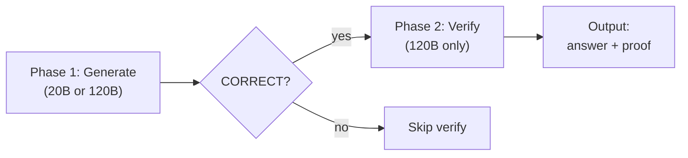
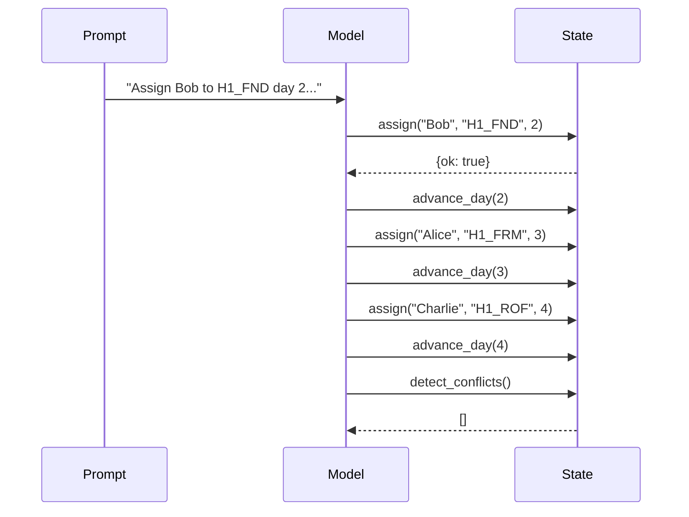
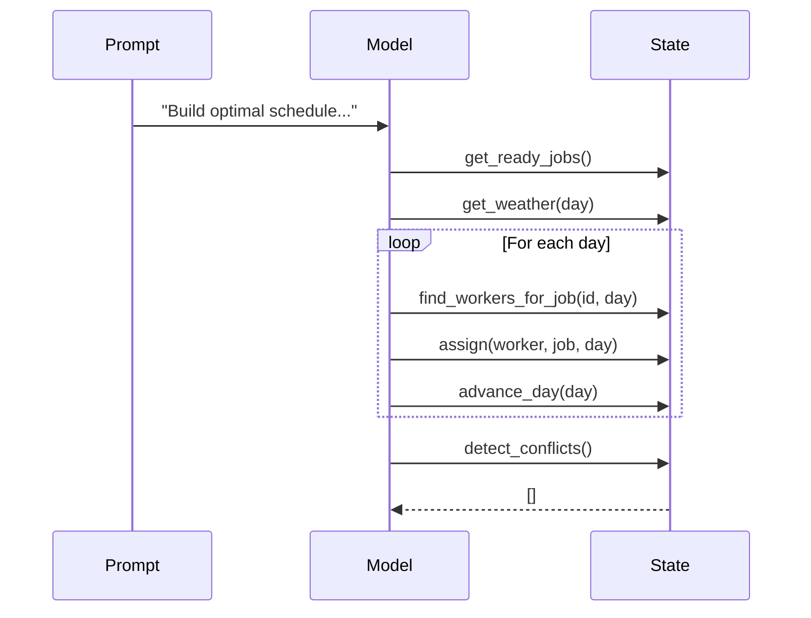
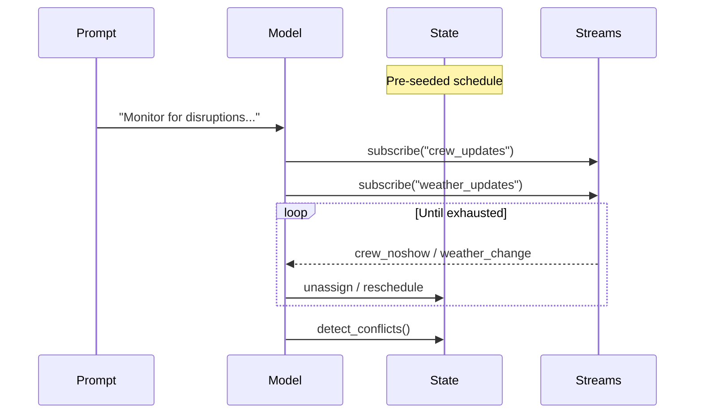
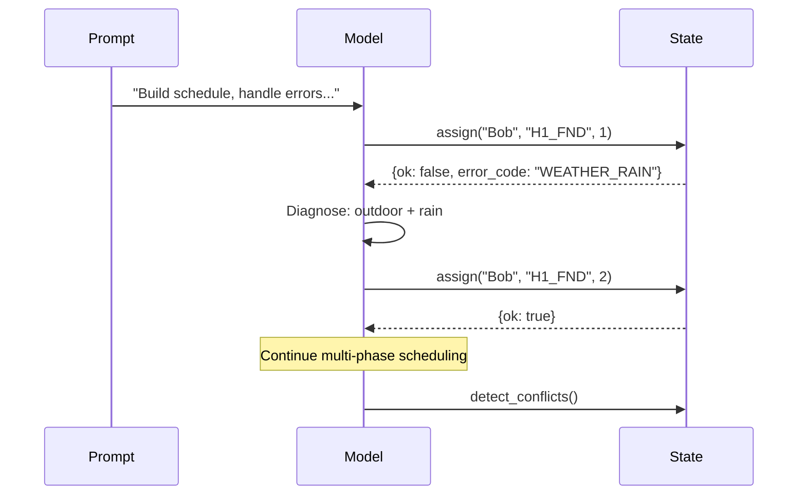
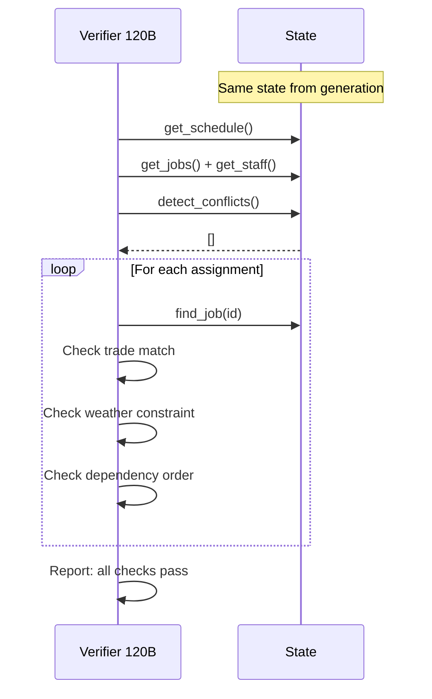

# Construction Scheduling Experiment

Validated eval with reverse verification.

**Date:** 2026-03-06
**Server:** localhost:8000 (Ollama)
**Models:** gpt-oss:20b, gpt-oss:120b
**Iterations:** 5
**Reference:** See `construction-scheduling-2026-03-06.md` for
prompts, host functions, test data, and architecture.

## Experiment Design

### Two-Phase Eval: Generate then Verify

Every tier runs in two phases. Phase 1 generates the answer.
Phase 2 immediately verifies it -- like checking your work in
math by working backwards. The generation and verification are
**paired together**: the verify step uses the exact same
`ConstructionState` that generation produced, with no gap
between them.

The verify phase asks 120B to work backwards through the
schedule: inspect every assignment, check trade qualifications,
confirm dependency ordering, verify weather constraints, detect
conflicts. If the verifier agrees the schedule is correct AND
has not mutated the state, the answer has been **proven correct
from both directions**.

### Why pair them?

The generation answer and the reverse-verification step happen
in the same iteration, on the same state object, with no
serialization boundary. This means:

- No data lost or corrupted between phases
- The verifier sees the exact state the generator produced
- Any mutation by the verifier is immediately detectable
  (schedule snapshot comparison)

## Tier Architecture

### T1: Prescriptive (follow explicit instructions)

Model translates natural language instructions into correct
function calls.

### T2: Scheduler (constraint satisfaction)

Model reasons about weather, dependencies, and trades to build
an optimal schedule from scratch.

### T3: Dispatcher (reactive stream processing)

Model reacts to real-time stream events on a pre-seeded
schedule. **Note:** stream_subscribe is currently broken
(issue #90) -- models pass via code-as-text fallback, not
actual stream processing.

### T4: Recovery (error handling + retry)

Model handles assignment failures, diagnoses error codes, and
retries with corrected parameters.

### T5: Verify (reverse proof)

120B works backwards through the generated schedule, verifying
each constraint holds. Instead of building a schedule that
satisfies constraints, the model starts with the schedule and
proves the constraints are satisfied.

## Scoring Criteria

| Tier | Checks |
| ------ | -------- |
| T1 | 3 assigns, 0 conflicts, exact assignments, completed |
| T2 | 5 assigns, 0 conflicts, completed, no outdoor d1, span<=4 |
| T3 | 0 conflicts, Alice off d3, no outdoor d4, Bob preserved |
| T4 | 5 assigns, 0 conflicts, completed, no outdoor d1 |
| T5 | Original tier checks + >=1 tool call + state preserved |

## Results (v4)

Tool depth: 20B=22, 120B=20. Format: verdict (duration, calls).

### T1 Prescriptive Generation

| Run | 20B | 120B |
| --- | --- | --- |
| 1 | CORRECT 6/6 (5s, 4) | INCORRECT 3/6 srv400 |
| 2 | CORRECT 6/6 (9s, 7) | INCORRECT 2/6 srv400 |
| 3 | INCORRECT 1/6 (8s, 0) | CORRECT 6/6 (23s, 6) |
| 4 | CORRECT 6/6 (3s, 1) | CORRECT 6/6 (9s, 2) |
| 5 | INCORRECT 1/6 (4s, 0) | CORRECT 6/6 (11s, 5) |
| **Sum** | **3/5** | **3/5** |

### T1 Prescriptive Verification

| Run | Source | Verify |
| --- | --- | --- |
| 1 | T1 20B | CORRECT 8/8 (10s, 1) state preserved |
| 2 | T1 20B | CORRECT 8/8 (13s, 1) state preserved |
| 3 | T1 120B | CORRECT 8/8 (11s, 1) state preserved |
| 4 | T1 20B | CORRECT 8/8 (11s, 1) state preserved |
| 4 | T1 120B | CORRECT 8/8 (14s, 1) state preserved |
| 5 | T1 120B | CORRECT 8/8 (11s, 1) state preserved |

### T2 Scheduler Generation

| Run | 20B | 120B |
| --- | --- | --- |
| 1 | CORRECT 5/5 (4s, 1) | CORRECT 5/5 (20s, 2) |
| 2 | CORRECT 5/5 (7s, 1) | CORRECT 5/5 (10s, 1) |
| 3 | CORRECT 5/5 (37s, 0) | CORRECT 5/5 (14s, 2) |
| 4 | CORRECT 5/5 (9s, 1) | CORRECT 5/5 (23s, 3) |
| 5 | CORRECT 5/5 (7s, 1) | CORRECT 5/5 (22s, 2) |
| **Sum** | **5/5** | **5/5** |

### T2 Scheduler Verification

All 10 CORRECT generations verified. All passed 7/7
with state preserved. Verifier used 1-6 tool calls per run.

### T3 Dispatcher Generation

| Run | 20B | 120B |
| --- | --- | --- |
| 1 | CORRECT 5/5 (37s, 0) | CORRECT 5/5 (26s, 4) |
| 2 | CORRECT 5/5 (13s, 0) | CORRECT 5/5 (39s, 6) |
| 3 | CORRECT 5/5 (20s, 1) | CORRECT 5/5 (25s, 3) |
| 4 | CORRECT 5/5 (21s, 1) | CORRECT 5/5 (32s, 5) |
| 5 | CORRECT 5/5 (6s, 0) | CORRECT 5/5 (40s, 4) |
| **Sum** | **5/5** | **5/5** |

### T3 Dispatcher Verification

All 10 CORRECT generations verified. All passed 7/7
with state preserved. Note: T3 verifier sees only 2
assignments (post-disruption schedule) but validation
checks are met.

### T4 Recovery Generation

| Run | 20B | 120B |
| --- | --- | --- |
| 1 | INCORRECT 2/4 (11s, 1) | INCORRECT 2/4 (9s, 0) |
| 2 | INCORRECT 2/4 (17s, 1) | CORRECT 4/4 (32s, 3) |
| 3 | INCORRECT 2/4 (8s, 1) | CORRECT 4/4 (68s, 8) |
| 4 | INCORRECT 2/4 (7s, 0) | CORRECT 4/4 (16s, 1) |
| 5 | INCORRECT 2/4 (6s, 1) | CORRECT 4/4 (117s, 11) |
| **Sum** | **0/5** | **4/5** |

### T4 Recovery Verification

| Run | Source | Verify |
| --- | --- | --- |
| 2 | T4 120B | CORRECT 6/6 (11s, 1) state preserved |
| 3 | T4 120B | CORRECT 6/6 (21s, 5) state preserved |
| 4 | T4 120B | CORRECT 6/6 (10s, 1) state preserved |
| 5 | T4 120B | CORRECT 6/6 (10s, 1) state preserved |

## Aggregate Generation Rates

| Tier | 20B | 120B |
| --- | --- | --- |
| T1 Prescriptive | 3/5 (60%) | 3/5 (60%) |
| T2 Scheduler | 5/5 (100%) | 5/5 (100%) |
| T3 Dispatcher | 5/5 (100%) | 5/5 (100%) |
| T4 Recovery | 0/5 (0%) | 4/5 (80%) |

## T5 Verification Rates

| Source | Verified | Passed | State Preserved |
| --- | --- | --- | --- |
| T1 (6 runs) | 6/6 | 6/6 (100%) | 6/6 |
| T2 (10 runs) | 10/10 | 10/10 (100%) | 10/10 |
| T3 (10 runs) | 10/10 | 10/10 (100%) | 10/10 |
| T4 (4 runs) | 4/4 | 4/4 (100%) | 4/4 |
| **Total** | **30/30** | **30/30 (100%)** | **30/30** |

## Key Findings

### 1. Reverse verification is 100% reliable

30/30 CORRECT generations were confirmed by 120B working
backwards through the schedule. Zero false positives. State
was preserved in every case (no verifier mutations).

### 2. T2 and T3 are solved tiers

Both models achieve 100% on scheduler and dispatcher tasks
across all 5 iterations. These tiers are no longer
discriminating.

### 3. T4 reveals a hard 20B capability boundary

20B scores 0/5 on recovery (was 1/5 in v3). It consistently
schedules only 2 of 5 jobs -- it handles the initial rain
error but cannot plan the multi-phase continuation (framing
after foundation, roofing after framing). 120B scores 4/5
(was 5/5 in v3), occasionally taking 11 tool calls and 2
minutes to complete.

### 4. T1 shows high variance for both models

Both 20B and 120B score 3/5 on prescriptive tasks. 120B
failures are server 400 errors (Ollama content-type bug),
not capability issues. 20B failures are 0-tool-call runs
where no code was executed.

### 5. Correctness validation catches false positives

20B consistently self-reports SUCCESS on T4 despite only
scheduling 2/5 jobs. Without external validation, these
would appear as correct answers.

### 6. stream_subscribe is broken (issue #90)

T3 models cannot actually subscribe to streams. They pass
by falling back to code-as-text output or error recovery.
The pre-seeded schedule state still satisfies validation
checks, but stream processing is never exercised.

## v3 vs v4 Comparison

| Tier | v3 20B | v4 20B | v3 120B | v4 120B |
| --- | --- | --- | --- | --- |
| T1 | 5/5 | 3/5 | 1/5 | 3/5 |
| T2 | 4/5 | 5/5 | 5/5 | 5/5 |
| T3 | 5/5 | 5/5 | 5/5 | 5/5 |
| T4 | 1/5 | 0/5 | 5/5 | 4/5 |

Changes: maxToolDepth increased from 10 to 20/22. Answer
capture added (code + result). T5 verification added.

## Data Files

Raw data in `/tmp/construction-eval-v4/run{1-5}/`. Each file:

- Room ID, tier, model, duration
- Verdict with per-check OK/FAIL detail
- LLM result text (full answer)
- Tool calls with `[code]` and `[result]` sections
- Final schedule, conflicts, completed jobs

Verification files: `{room}-verify.txt` alongside their
paired generation file.
