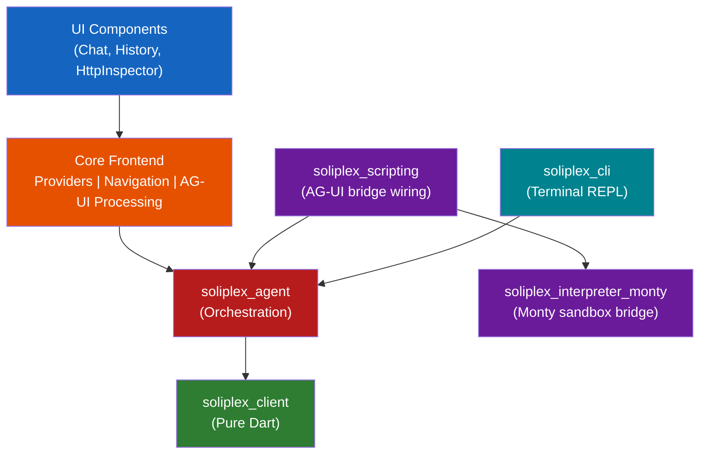

# Soliplex Flutter Documentation

A cross-platform Flutter frontend for the Soliplex AI-powered RAG system,
built on the AG-UI streaming protocol.

## Start Here

**New to the codebase?** Follow this reading order:

1. [Developer Setup](getting-started/developer-setup.md) — Get the app building and running
1. [Architecture Overview](getting-started/architecture-overview.md) — 10-minute mental model of the system
1. [CLI Quickstart](getting-started/cli-quickstart.md) — Interact with the agent runtime hands-on
1. [Agent Stack Reference](architecture/agent-stack.md) — Canonical technical reference
1. [Agent Integration Guide](architecture/agent-integration-guide.md) — How consumers wire into the agent
1. [Tutorials](tutorials/) — Step-by-step guides for common tasks

**Building or debugging HTTP/networking?**

- [HTTP Networking Stack](architecture/http-stack.md) — Decorator chain architecture
- [HTTP Extension Guide](architecture/http-extension-guide.md) — Adding decorators and observers

---

## Architecture

```mermaid
flowchart TD
    A["UI Components\n(Chat, History, HttpInspector)"]
    B["Core Frontend\nProviders | Navigation | AG-UI Processing"]
    C["soliplex_agent\n(Orchestration)"]
    D["soliplex_client\n(Pure Dart)"]
    E["soliplex_scripting\n(AG-UI bridge wiring)"]
    F["soliplex_interpreter_monty\n(Monty sandbox bridge)"]
    G["soliplex_cli\n(Terminal REPL)"]

    A --> B
    B --> C
    C --> D
    E --> C
    E --> F
    G --> C

    style A fill:#1565c0,color:#fff
    style B fill:#e65100,color:#fff
    style C fill:#b71c1c,color:#fff
    style D fill:#2e7d32,color:#fff
    style E fill:#6a1b9a,color:#fff
    style F fill:#6a1b9a,color:#fff
    style G fill:#00838f,color:#fff
```

## Packages

| Package | Type | Description |
|---------|------|-------------|
| [soliplex_agent](../packages/soliplex_agent/README.md) | Pure Dart | Agent orchestration (RunOrchestrator, AgentRuntime, AgentSession) |
| [soliplex_cli](../packages/soliplex_cli/README.md) | Dart | Interactive REPL for exercising soliplex_agent |
| [soliplex_client](../packages/soliplex_client/README.md) | Pure Dart | HTTP/AG-UI client, models, sessions |
| [soliplex_client_native](../packages/soliplex_client_native/README.md) | Flutter | Native HTTP adapters (iOS/macOS via Cupertino) |
| [soliplex_interpreter_monty](../packages/soliplex_interpreter_monty/README.md) | Pure Dart | Monty Python sandbox bridge |
| [soliplex_logging](../packages/soliplex_logging/README.md) | Pure Dart | Logging primitives, DiskQueue, BackendLogSink |
| [soliplex_schema](../packages/soliplex_schema/README.md) | Pure Dart | Feature schema parsing and validation |
| [soliplex_scripting](../packages/soliplex_scripting/README.md) | Pure Dart | Wiring AG-UI to interpreter bridge |
| [soliplex_dataframe](../packages/soliplex_dataframe/README.md) | Pure Dart | In-memory DataFrame engine |
| [soliplex_skills](../packages/soliplex_skills/README.md) | Pure Dart | Skill models and registry |
| [soliplex_tui](../packages/soliplex_tui/README.md) | Dart | Terminal UI client |

## Documentation Sections

### Getting Started

- [Developer Setup](getting-started/developer-setup.md) — Environment, dependencies, build
- [Architecture Overview](getting-started/architecture-overview.md) — System mental model
- [CLI Quickstart](getting-started/cli-quickstart.md) — Hands-on agent interaction

### Architecture (Reference)

- [Agent Stack](architecture/agent-stack.md) — Canonical agent package reference
- [Agent Integration Guide](architecture/agent-integration-guide.md) — Consumer wiring patterns
- [HTTP Networking Stack](architecture/http-stack.md) — Decorator chain, CancelToken flow
- [HTTP Extension Guide](architecture/http-extension-guide.md) — Adding decorators and observers
- [CLI + Monty Guide](architecture/cli-monty-guide.md) — CLI commands and Python usage
- [Python Host Functions](architecture/python-host-functions.md) — Host function reference

### Tutorials

- [Your First Agent](tutorials/01-your-first-agent.md) — Spawn an agent, observe lifecycle
- [Building a Custom Tool](tutorials/02-building-a-custom-tool.md) — ToolRegistry and ToolExecutor
- [Implementing HostApi](tutorials/03-implementing-host-api.md) — HostApi/FormApi contracts
- [Adding Python Scripts](tutorials/04-adding-python-scripts.md) — ScriptEnvironment walkthrough

### Reference

- [soliplex_agent API](reference/soliplex-agent-api.md) — Full public API surface
- [Host API Contract](reference/host-api-contract.md) — HostApi, FormApi, BlackboardApi specs
- [Tool System](reference/tool-system.md) — Registry, resolver, execution context
- [Platform Constraints](reference/platform-constraints.md) — Native/mobile/web differences
- [Error Classification](reference/error-classification.md) — FailureReason taxonomy

### Guides

- [Logging Quickstart](guides/logging-quickstart.md) — Usage guide for the logging system
- [Logging Architecture](guides/logging.md) — DiskQueue, BackendLogSink, testing patterns
- [Flush Gating](guides/flush-gating.md) — Log flush control
- [Flutter Rules](rules/flutter_rules.md) — Development conventions and best practices

### Architecture Decision Records

- [ADR-001: White-Label Architecture](adr/001-whitelabel-architecture.md) — Configuration-based whitelabeling
- [ADR-002: Backend Log Shipping](adr/002-backend-log-shipping.md) — Disk-backed log shipping via Logfire
- [ADR-003: Agent Supervision](adr/003-agent-supervision.md) — Supervision tree spike

### Active Design and Planning

- [Agent Runtime Vision](design/agent-runtime-vision.md) — High-level vision and philosophy
- [Multi-Server Support](design/multi-server-support.md) — Multi-server architecture (active)
- [Planning Documents](planning/) — Implementation plans and slices

### Maintenance

- [Documentation Roadmap](DOCUMENTATION-ROADMAP.md) — This documentation overhaul plan
- [Maintenance Protocol](MAINTENANCE.md) — Self-validating doc health checks
