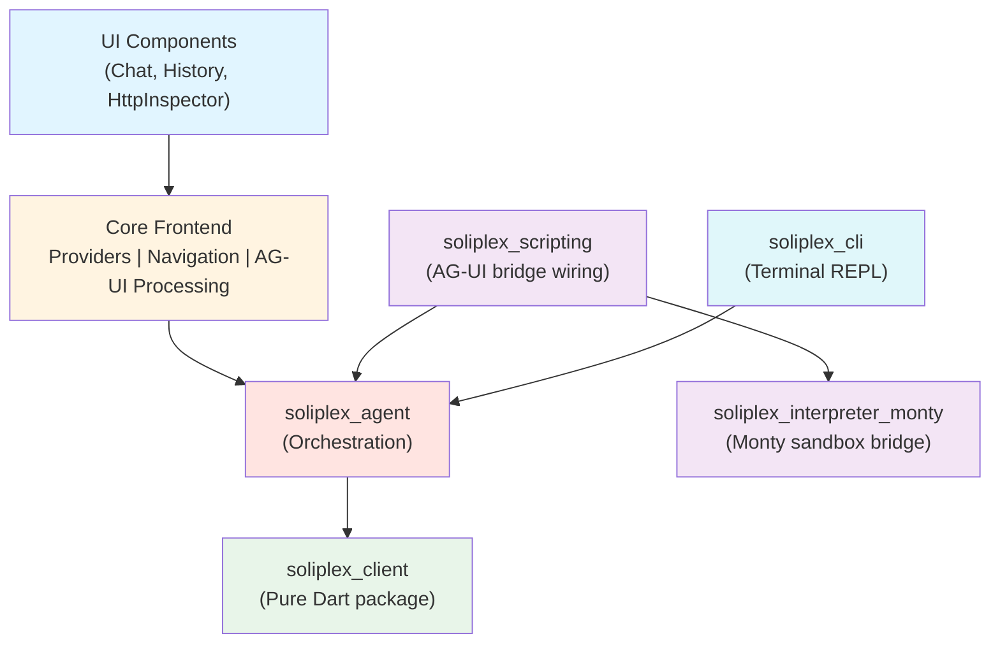

# Soliplex Flutter Documentation

This documentation covers the Soliplex Flutter frontend - a cross-platform chat application with AG-UI streaming protocol support.

The current frontend focuses on core chat functionality with essential features implemented.

## Quick Links

| Area | Description |
|------|-------------|
| [Developer Setup](guides/developer-setup.md) | Environment setup and getting started |
| [Flutter Rules](rules/flutter_rules.md) | Development conventions and best practices |
| [Client Package](summary/client.md) | Pure Dart client library documentation |
| [Logging Architecture](guides/logging.md) | Logging package internals and testing |
| [Logging Quickstart](logging-quickstart.md) | Usage guide for the logging system |

---

## Documentation Sections

### Guides

- [Developer Setup](guides/developer-setup.md) - Environment setup, dependencies, and build instructions
- [Logging Quickstart](logging-quickstart.md) - How to use loggers, log levels, and troubleshooting
- [Logging Architecture](guides/logging.md) - DiskQueue, BackendLogSink, and testing patterns

### Rules & Standards

- [Flutter Rules](rules/flutter_rules.md) - Flutter development conventions and best practices

### Architecture Decision Records

- [ADR-001: White-Label Architecture](adr/001-whitelabel-architecture.md) - Configuration-based whitelabeling
- [ADR-002: Backend Log Shipping](adr/002-backend-log-shipping.md) - Disk-backed log shipping via Logfire

### Package Documentation

- [Client Package](summary/client.md) - soliplex_client architecture and usage
- [Agent Package](../packages/soliplex_agent/README.md) - soliplex_agent orchestration layer
- [CLI Package](../packages/soliplex_cli/README.md) - Interactive REPL for soliplex_agent
- [Scripting Package](../packages/soliplex_scripting/README.md) - AG-UI to interpreter bridge wiring
- [Interpreter Monty Package](../packages/soliplex_interpreter_monty/README.md) - Monty Python sandbox bridge

---

## Project Overview

### Architecture

The project follows a four-layer architecture:

### Packages

| Package | Type | Status | Description |
|---------|------|--------|-------------|
| `soliplex_agent` | Pure Dart | Implemented | Agent orchestration (RunOrchestrator, AgentRuntime, AgentSession) |
| `soliplex_cli` | Dart | Implemented | Interactive REPL for exercising soliplex_agent |
| `soliplex_client` | Pure Dart | Implemented | HTTP/AG-UI client, models, sessions |
| `soliplex_client_native` | Flutter | Implemented | Native HTTP adapters (iOS/macOS via Cupertino) |
| `soliplex_interpreter_monty` | Pure Dart | Implemented | Monty Python sandbox bridge |
| `soliplex_logging` | Pure Dart | Implemented | Logging primitives, DiskQueue, BackendLogSink |
| `soliplex_scripting` | Pure Dart | Implemented | Wiring AG-UI to interpreter bridge |

### Design & Planning

- [Design Documents](design/index.md) - Architecture design documents and diagrams
- [Planning Documents](planning/) - Implementation planning slices and references
- [PLANS](../PLANS/) - Sprint plans, specs, and audit findings

### Implemented Features

- Chat with streaming AI responses (AG-UI protocol)
- Thread history with management
- Multi-room support
- OIDC authentication (platform-specific flows)
- HTTP traffic inspector (feature-flagged)
- In-app log viewer with level filtering
- Quiz feature
- Settings screen
- Responsive layout (desktop/mobile)
- Backend log shipping with disk-backed queue
